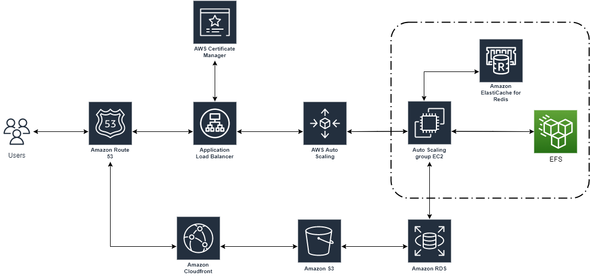

# Challenge-Lab-AWS


## Challenges
Deploy web application from https://github.com/qyjohn/web-demo to a fault tolerent AWS Environment.

- Implement auto scalling 
  - Check **Step 5**
- How can we speed up the deployment process?
  - **Infrastucture as Code** - We can use IAC to speedup the deployment. We can ether use **Terraform** or **AWS cloud Formation**  for this  
- security for app , more Secure how?
   - For EC2- We can use **Roles** to access the S3.
   - **AWS WAF** and **CDN** is also a good consideration to imporove security
   - **For Apache** -  Disable the server-info Directive, server-status Directive.
   - Also can disable public access to EC2 by restricting secuity group to load balancer only (as we are delivering by LB to Public).
   - Monitor Logs 
 - Perfomance issue , cloud watch,cpu monitoring, accesslogs, deatils of instance
   - To improve perfomance we can use **AWS ElastiCache** , Memcached & Redis. once launched update on Config.php
   - **Cloud watch** is a good way to monitor logs in EC2, I have wriiten a blog on this (How to **deliver logs to CloudWatch from Ec2** - [iCTPro.co.nz](https://ictpro.co.nz/how-to-monitor-unauthorized-ssh-attempts-on-your-server-get-email-alert-100-days-of-cloud-day-12/?utm_source=rss&utm_medium=rss&utm_campaign=how-to-monitor-unauthorized-ssh-attempts-on-your-server-get-email-alert-100-days-of-cloud-day-12), [dev.to](https://dev.to/aws-builders/how-to-monitor-unauthorized-ssh-attempts-on-your-server-get-email-alert-7cp)) . We can deliver /var/log/apache2/access.log , /var/log/apache2/error.log with this method.
- Adding S3 for static assests
   - Refer **Step 6**
- CDN - CloudFront
  - Refer **Step 7**
</br>


 
 (S3 implentation still have some issues on above demo , troubleshooting
 - i have updated the s3 information as mentiond on step 6 and can upload the images via APP.
 - issue - cannot preview the uploaded images via app
 - Suspecting its a permission issue on the LAB Environment to update the policy on S3 )

</br>

 - **Amazon Certificate Manager** - Using ACM we can get a SSL certificate and deliver it throuh Route 53
   - Issue a Certificate , Update DNS Validation and   update the lister -  Port 443 to forward to targetgroup created.
 - Also can edit the /etc/apache2/sites-available/000-default.conf to change the apache folder to point it web-demo


## Architectural diagram




(Didnot got time to implement Redis and S3 )

----

## Deploying the App 

### Step 1. Setup EC2

#### Launch EC2 and SSH into EC2
- Ubuntu 20.4 
- Enable Public IP
- Security Group (Name : SG-EC2-AWS-LAB)
  
| Protcol   | Port range      | Source    |
| ------------ | ------------ | ------------ |
|  HTTP | 80   | 0.0.0.0/0   |
|  HTTPS |  443    | 0.0.0.0/0 |
|SSH |    22     | your IP |


#### Install MYSQL, Apache, AWS CLI and PHP

```
sudo apt-get update
sudo apt-get install mysql-server
sudo apt-get install apache2 php libapache2-mod-php php-mysql php-curl php-xml php-memcached awscli 
sudo service apache2 restart
```

#### Attach EFS
- Goto Step **step 3** and comeback


#### Verify Git Install, folder permissions & clone application  repo

```
# change folder permissions
sudo chown -R ubuntu:ubuntu /var/www 
```
```
# get the app from git
cd /efs
git --version
git clone https://github.com/qyjohn/web-demo
cd web-demo
```
```
# Folder persmission to Apache to upload
cd web-demo
sudo chown -R www-data:www-data uploads
sudo service apache2 restart
```
```
# link to web-folder
cd /var/www/html 
sudo ln -s /efs/web-demo web-demo
sudo service apache2 restart 
```

Now add a command to /etc/fstab to auto mount EFS after reboot.
```
<EFS-endpoint-url>:/ /efs nfs defaults,_netdev 0 0
```


#### Update RDS from the backup
Goto Step **2. RDS** and come back once completed.  

- Sign into RDS

```
mysql -h [endpoint-of-rds-instance] -u admin –p
```

- Create DB, username and password 
  
```
CREATE DATABASE web_demo; 

CREATE USER 'username'@'%' IDENTIFIED BY 'password';
```

- Grant privilages
  
```
GRANT ALL PRIVILEGES ON web_demo.* TO 'user.name'@'%'; 
exit
```

- Update the backup to rds.
  Now on ec2
  
  ```
  cd /efs/web-demo
   mysql -h <db-endpoint from rds> -u user.name -p web_demo < web_demo.sql
  ```
#### Update Config File
- update the config file with all DB info.
```
$db_hostname = db enpoint;
$db_database = "web_demo";
$db_username = "username";
$db_password = "password";
```  

#### S3 

 
 Refer **Step 4**


#### Cloudfront

Refer **Step 5**

#### Creating Amazon machine image (AMI)
- Go to EC2 console 
- Select EC2 , Actions, Image and Templetes , Then click Create Image. 
- Wait till AMi created you can check this on Images area on EC2 Console

#### Launch One more EC2 for Load Balancer
 - Goto you AMI and Launch With Enabled Public IP, Created IAM Role , Keypair & Security Group For EC2 (SG-EC2-AWS-LAB)

#### Setup Load Balancer
- Refer **Step  7**

#### Create Auto Scaling
- Refer **Step 8**

 #### Create a dashboard (optional)
 - Goto cloudwatch and create dashoard
 - ADD RDS and Ec2 Mertics

  -----
### Step 2. RDS 
- Create RDS Security Group (Name: SG-RDS-AWS-LAB)
  
| Protcol   | Port range      | Source    |
| ------------ | ------------ | ------------ |
|MYSQL|3306|SG-EC2-AWS-LAB|

- Create a MYSQL RDS with SG created above.

### Step 3. EFS
- Install nfs-common on EC2
  ```
  sudo apt-get install nfs-common -y
  ```
- Create a mount folder efs on root
  ```
  sudo mkdir -p /efs
  ```  
- Update Security group 

| Protcol   | Port range      | Source    |
| ------------ | ------------ | ------------ |
|NFS|2049|SG-EC2-AWS-LAB|

- Create a EFS
- Update the SG in EFS under network tab
- mount the EFS to EC2
  ```
  sudo mount -t nfs4 -o nfsvers=4.1,rsize=1048576,wsize=1048576,hard,timeo=600,retrans=2,noresvport <efs--endpoint>:/ efs
  ```
- Give permission
    ```
   sudo chown -R ubuntu:ubuntu /efs 
    ```
Go to Step 1 section -  Verify Git Install, folder permissions & clone application repo


### Step 4. S3
- Create a **IAM Role**  to grants access to Amazon S3 and assign role to EC2. (No permission in lab to create role)
- Create and S3 Bucket
- Create a folder named `uploads`
- Enable Access control list (ACL)
-  Change - ACLs to enabled
   - Update bucket policy with GET, PUT actions ,
   - Enable public access, 

Once you have done this update the Config.php file with
information 

```
$s3_region  = "ap-southeast-2";
$s3_bucket  = "bucket_name";
$s3_prefix  = "uploads";
$s3_baseurl = "https://bucket_name.s3-region-name.amazonaws.com/";
```
Goto step 1 section Cloudfront

### Step 5. CloudFront

- Goto CloudFront Dashbaord and click **Create distribution**
- Orgin - select the S3 we created above
- OAI (optional) - Enabling this will help you to acess S3 content via `CloudFront` only
- Origin path - /uploads
- SHIELD ORGIN - `WAF` if you have created one , else leave it 
- Viewer protocol policy - `Redirect HTTP to HTTPS`.
- Custom SSL certificate (optional) - If you have created `ACM` you can add that here
- Standard logging - `ON` 


Once the distribution is created grab the Domain name from dashboard and update it on the Config file
```
$enable_cf  = true;
$cf_baseurl = "http://xxxxxxxxxxxxxx.cloudfront.net/";
```
Goto step 1 section Creating AMI

### Step 6. Cloud-Watch
- **Cloud watch** is a good way to monitor logs in EC2, I have wriiten a blog on this (How to **deliver logs to CloudWatch from Ec2** - [iCTPro.co.nz](https://ictpro.co.nz/how-to-monitor-unauthorized-ssh-attempts-on-your-server-get-email-alert-100-days-of-cloud-day-12/?utm_source=rss&utm_medium=rss&utm_campaign=how-to-monitor-unauthorized-ssh-attempts-on-your-server-get-email-alert-100-days-of-cloud-day-12), [dev.to](https://dev.to/aws-builders/how-to-monitor-unauthorized-ssh-attempts-on-your-server-get-email-alert-7cp)) . We can deliver /var/log/apache2/access.log , /var/log/apache2/error.log with this method.
- We can create a dashboard and add alarms from auto-scaling and for EC2 metrics.
  


### Step 7. Load Balancer

- **Create target Group**
  - Choose a target type as Instance
  - Name it as TargetGroup-AWS-LAB
  - Keep Protocol as HTTP-80
  - Now select the Two-instance and click Include as Pending Below.
  - Click Create Target Group.
- **Create LoadBalancer**
  - Select ApplicationLoad Balancer
  - Name It (Loadbalancer-AWS-LAB)
  - Select Internet facing
  - NetworkMapping - Slect all avilability Zones
  - Select Ec2 Security Group
  - Select Listener , HTTP-80-TargetGroup-AWS-LAB
  - Click Create Loadbalancer


### Step 8. Auto-scalling


- Creating Launch Template
  - On Ec2 Dashboard Select Launch Template and click Create Launch Template.
  - Name it LaunchTemplate-AWS-EC2
  -  Name the Launch Templete
  -  Selected EC2 AMI we have created earlier
  -  kept t2.micro asInstance type 
  -  Selected Key pair
  -  Selected (SG-EC2-AWS-LAB) security group.

- Creating Auto Scaling Groups
   - On EC2 Dash Board Select Auto Scaling Groups
   - Click on to Create Auto Scaling Groups
   - Name it as AutoScaling-AWS-LAB
   - Select all avialable  **Subnets**
   - Attach to an **existing load balancer**
   - Select Choose from your load balancer target groups
     - Slect Previously created **Target Group**
   - Health check **grace period** - 300
   - Enable **Monitoring** (optional)
   - Desired capacity **1** ,Minimum capacity **1**, Maximum capacity **4**.
   - **Target tracking scaling policy** , **Avarage CPU Utilisation** - TargetValue **85%**
   - Add Notifications - you can add **SNS Notifications when ever auto scalling triggers** 
     - Create new SNS Topic , Add a Name and Email address Click Next
   - Click create auto scaling
  
  </br>

  